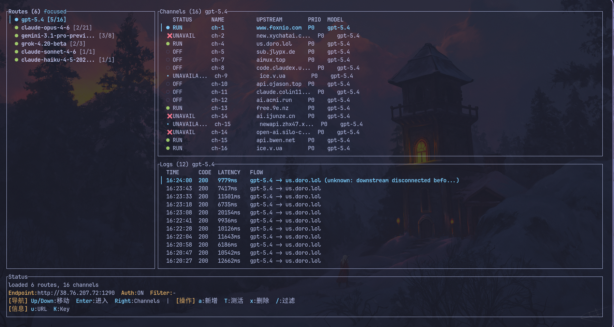

# llmrouter

一个轻量的 LLM 路由网关。

## 特点

- 单二进制部署
- 请求自动路由
- 支持 TUI 管理、主动一键测活、运行状态查看
- 支持在claude code中使用openai兼容模型
- 支持导入cc-switch已配置模型



## 核心概念

| 概念 | 说明 |
| --- | --- |
| Route | 稳定的下游模型名，例如 `gpt-5.4` |
| Channel | Route 下的一条具体上游通道，包含 `base_url`、`api_key`、`upstream_model`、`protocol`、`priority` |
| Priority | 越小越优先，只在最小 `priority` 组内继续选路 |
| Cooldown | 请求失败后的自动冷却状态，带倒计时 |

## 快速开始

### 本机模式

### Linux

```bash

# 单机模式：server + tui，一次装好
curl -fsSL https://raw.githubusercontent.com/nodca/routellm/main/scripts/install-local.sh | sudo bash

# 一键卸载
curl -fsSL https://raw.githubusercontent.com/nodca/routellm/main/scripts/uninstall-local.sh | sudo bash
```

### Windows

请在管理员 PowerShell 中运行单机安装命令。

```powershell

# 单机模式：server + tui，一次装好
irm https://raw.githubusercontent.com/nodca/routellm/main/scripts/install-local.ps1 | iex

# 一键卸载
irm https://raw.githubusercontent.com/nodca/routellm/main/scripts/uninstall-local.ps1 | iex
```

安装后：

- Linux TUI 直接运行 `lrtui`
- Windows TUI 新开终端后直接运行 `lrtui`

从本机 `cc-switch` 导入：

```bash
# 默认读取 ~/.cc-switch/cc-switch.db
lrtui --import cc-switch

# 或显式指定 sqlite 路径
lrtui --import /path/to/cc-switch.db
```


### 服务器 + 本机 TUI 模式

这是更常见的用法：

1. 在远程 Linux 服务器上安装并启动 `server`
2. 在你自己的电脑上安装 `TUI`
3. `TUI` 连接远程 `server` 的管理地址
4. 下游客户端统一请求这台服务器的 `/v1`

服务端部署：

```bash
curl -fsSL https://raw.githubusercontent.com/nodca/routellm/main/scripts/install-server.sh | sudo bash
```

安装完成后，服务端会：

- 默认监听 `0.0.0.0:1290`
- 注册 `systemd` 开机自启动
- 自动随机生成一个 `master_key`


本机安装 TUI：

Linux：

```bash
curl -fsSL https://raw.githubusercontent.com/nodca/routellm/main/scripts/install-tui.sh | \
  bash -s -- --server http://你的服务器IP:1290 --auth-key 你的master_key
```


Windows：

```powershell
$script = [scriptblock]::Create((irm https://raw.githubusercontent.com/nodca/routellm/main/scripts/install-tui.ps1)); & $script -Server "http://你的服务器IP:1290" -AuthKey "你的master_key"
```

下游客户端配置：

- Base URL：`http://你的服务器IP:1290/v1`
- API Key：填写服务端的 `master_key`
- model：填写你在 route 里定义的模型名，例如 `gpt-5.4`

### 手动启动

如果你不用安装脚本，而是直接手动启动二进制，建议自己先生成一个随机 `master_key`。

例如：

```bash
export LLMROUTER_MASTER_KEY="sk-llmrouter-$(openssl rand -hex 18)"
```

```bash
LLMROUTER_BIND_ADDR=127.0.0.1:1290 \
LLMROUTER_DATABASE_URL=sqlite://./llmrouter-state.db \
LLMROUTER_MASTER_KEY=$LLMROUTER_MASTER_KEY \
LLMROUTER_CONFIG_PATH=./examples/llmrouter.toml \
./target/release/llmrouter
```

```bash
LLMROUTER_BASE_URL=http://127.0.0.1:1290 \
LLMROUTER_AUTH_KEY=$LLMROUTER_MASTER_KEY \
./target/release/llmrouter-tui
```

校验配置：

```bash
./target/release/llmrouter check-config ./examples/llmrouter.toml
```

## 路由规则

每个 channel 都必须显式指定协议：

- `responses`
- `chat_completions`
- `messages`


选路顺序：

1. 根据请求里的 `model` 匹配 route
2. 过滤不可用 channel：
   `OFF`、`UNAVAIL`、冷却中、协议不兼容、站点/账号不可用
3. 取最小 `priority` 的可用组
4. 同优先级内优先直连协议
5. 同优先级且同协议成本时，优先历史延迟更低的 channel
6. 最后按添加顺序稳定落位

## 状态与故障处理

主要状态：

| 状态 | 说明 |
| --- | --- |
| `RUN` | 可用 |
| `COOL 23s` | 自动冷却中 |
| `UNAVAIL` | 不可用。包括手动阻断、主动测活失败，或冷却结束后仍待成功复检的 channel |
| `OFF` | 手动禁用 |
| `PROBING` | 正在主动测活 |

主动测活：

- `t`：测活当前 channel
- `T`：并发测活当前 route 下全部 channel，并实时刷新结果
- 测活成功回到 `RUN`
- 测活失败默认进入 `UNAVAIL`

运行时策略：

- 请求失败会进入冷却或不可用状态
- 同一次请求内会尝试切到下一个可用 channel
- 如果当前 route 下所有 channel 都不可用，会直接返回错误，不无限等待

## TUI

布局：

- 左侧：Routes
- 右上：Channels
- 右下：Logs
- 底部：Status

导入 `cc-switch`：

- `lrtui --import cc-switch`
- `lrtui --import /path/to/cc-switch.db`

导入时会自动确保这三个 route 存在：

- `gpt-5.4`
- `claude-opus-4-6`
- `gemini-3.1-pro-preview`

CLI 执行结束后会打印：

- `imported_channels`
- `created_routes`
- `skipped`

常用快捷键：

| 按键 | 功能 |
| --- | --- |
| `Left/Right` | 左右切换 pane |
| `Up/Down` | 移动选中项 |
| `Home/End` | 跳到顶部 / 底部 |
| `PgUp/PgDn` | 快速翻页 |
| `/` | 过滤 routes |
| `a` | 新增 route 或 channel |
| `i` | 编辑当前 channel |
| `x` | 删除当前项 |
| `Space` | 快速切换 channel 状态 |
| `c` | 恢复 channel，清掉冷却 / 阻断 |
| `t` | 测活当前 channel |
| `T` | 测活当前 route |
| `u` | 复制下游 Base URL |
| `K` | 复制下游 API Key |
| `Enter` | 进入或查看详情 |
| `Esc` | 返回 / 取消 |
| `r` | 刷新 |
| `?` | 帮助 |
| `q` | 退出 |

TUI 能管理应用状态，但不能替代系统级运维工具。服务启停、systemd、计划任务这些仍然由系统管理。

## 配置

`llmrouter.toml` 描述静态拓扑，SQLite 保存运行态状态和日志。

最小示例：

```toml
[server]
bind_addr = "127.0.0.1:1290"
database_url = "sqlite://llmrouter-state.db"
request_timeout_secs = 90
master_key = "sk-llmrouter-your-random-key"

[routing]
default_cooldown_seconds = 300

[routing.cooldowns]
auth_error = 1800
rate_limited = 45
upstream_server_error = 300
transport_error = 30
edge_blocked = 1800
upstream_path_error = 1800
unknown_error = 300

[routing.manual_intervention]
auth_error = true
upstream_path_error = true

[[routes]]
model = "gpt-5.4"
cooldown_seconds = 300

[[routes.channels]]
base_url = "https://api.example.com/v1"
api_key = "sk-example-primary"
upstream_model = "gpt-5.4"
protocol = "responses"
priority = 0
enabled = true

[[routes.channels]]
base_url = "https://api-backup.example.com/v1"
api_key = "sk-example-backup"
upstream_model = "gpt-5-4"
protocol = "chat_completions"
priority = 1
enabled = true
```

channel 字段：

| 字段 | 说明 |
| --- | --- |
| `base_url` | 上游根地址，可直接填写带 `/v1` 的兼容地址 |
| `api_key` | 上游 key |
| `upstream_model` | 实际发给上游的模型名 |
| `protocol` | 必填，`responses` / `chat_completions` / `messages` |
| `priority` | 必须 `>= 0`，越小越优先 |
| `enabled` | 是否启用 |

## 鉴权与 API

如果设置了 `master_key`，以下接口统一要求 Bearer Token：

- `/v1/*`
- `/api/*`

`/healthz` 不鉴权。

管理 API：

- `GET /healthz`
- `GET /api/routes`
- `POST /api/routes`
- `DELETE /api/routes/:id`
- `GET /api/routes/:id/channels`
- `GET /api/routes/:id/logs`
- `POST /api/routes/:id/channels`
- `GET /api/channels/:id/prefill`
- `POST /api/channels/:id/probe`
- `PATCH /api/channels/:id`
- `DELETE /api/channels/:id`
- `POST /api/channels/:id/enable`
- `POST /api/channels/:id/disable`
- `POST /api/channels/:id/reset-cooldown`

## 当前限制

- 没有 Web UI
- 没有多用户、计费、配额、多租户
- 没有复杂智能调度和负载均衡
- 还没有自动协议探测
- 仍然依赖 SQLite 保存运行态
- Windows 可用，但主支持平台仍更偏 Linux

## 开发

```bash
cargo fmt
cargo test
```

## License

MIT
